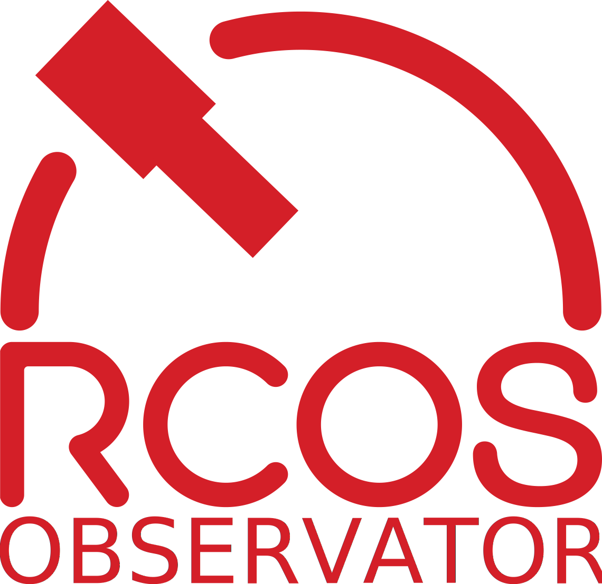

# Observatory-new




Rewrite of the RCOS observatory in a way that hopefully makes a bit more sense.
Since we have kinda lost track of what number we're on at this point I am
codenaming this version Observatory-New (I think it's the 5th version though).

This implementation is intended to be simpler than previous incarnations in
order to be easier to maintain in the long run.

It renders pages as plain HTML with minimal JavaScript and uses SQLite
as the database backend.

If you would like to help out please read [CONTRIBUTING.md](./CONTRIBUTING.md).

## Major Dependencies
- [Diesel](https://diesel.rs): Database ORM
- [Rocket](https://rocket.rs): Web framework
- [Askama](https://github.com/djc/askama): Templating engine
- [FullCalendar](https://fullcalendar.io/): For JavaScript calendars
- [Bootstrap](https://getbootstrap.com): CSS framework

## Building
Before anything else make sure that you have the development tools for your
system. On Ubuntu/Debian you can install these with:

```
$ sudo apt install build-essential pkg-config
```

Then you need to install the `openssl` development headers.
How to do this varies by system but on Ubuntu the package is
`libssl-dev` and should be similar on other distros.

Next install Rust with [Rustup](https://rustup.rs). Instructions are on the
website linked and is fairly straightforward.

Rocket requires Rust Nightly ([for now](https://github.com/SergioBenitez/Rocket/issues/19)).
This can be set for the Observatory-new repository folder specifically by running
```
rustup override set nightly
```
in cloned folder.
As of Rustup 1.20.0 this will automatically install the additional tools and can be updated
with `rustup update`.

After that it's as simple as
```
$ cargo build
```

And to run do
```
$ cargo run
```

## Deploying

**This is for deploying to a server, not a developer machine**

Please read [the Deploying instructions](./DEPLOYING.md) for information on how to setup
and deploy observatory-new.

## Documentation
The code is primarily documented using in-code doc comments.
This can be viewed either by browsing the source or in a web browser with.
```
$ cargo doc --no-deps --document-private-items --all-features --open
```
